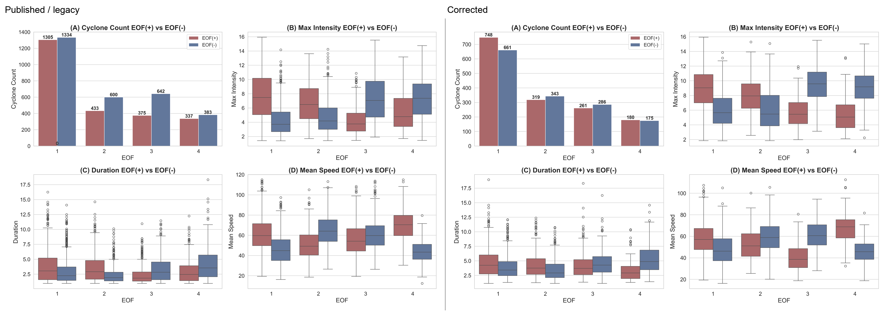
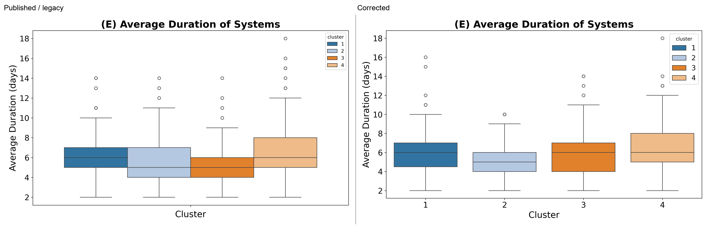
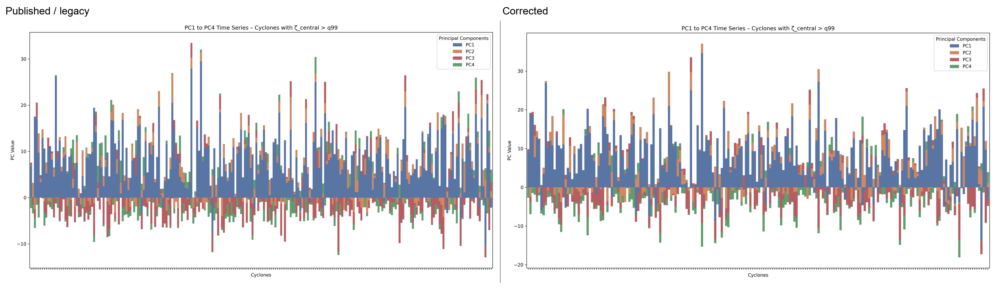
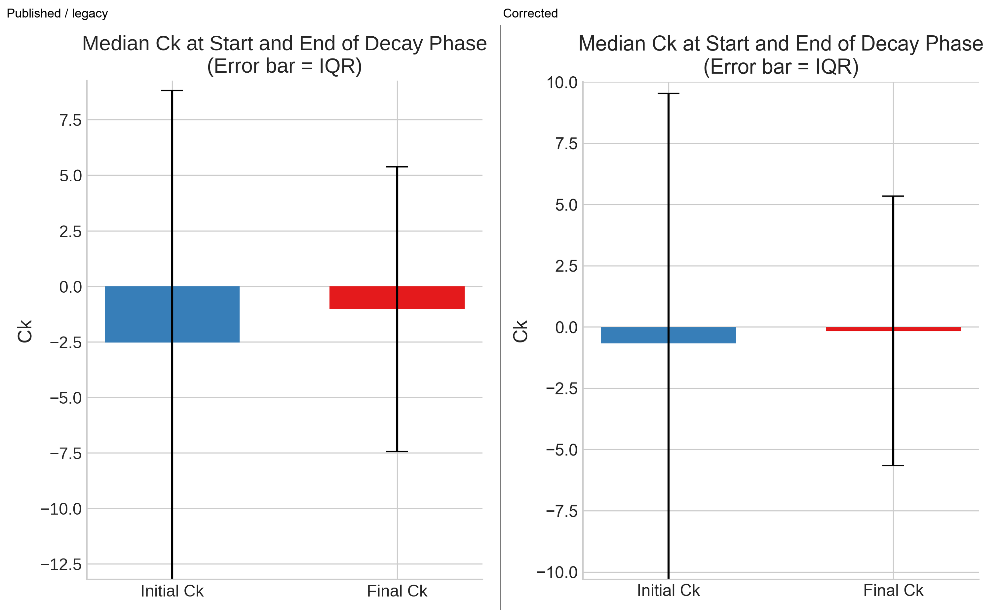

# Supplementary figures: published and corrected

The four supplementary figures in the final revision-2 submission have been reconstructed using the published scripts as the operational definitions. The original PNGs are copied verbatim from that submission. Each comparison image places the published figure on the left and the corrected rerun on the right. Numerical inputs and SHA-256 manifests are in `results/{original,corrected,comparison}/supplementary/`.

The original total-EOF population has 6,789 cyclones; the corrected population has 3,820. The corrected EOF scores retain the published mode identities through one-to-one pattern matching and joint sign alignment. Supplementary comparisons involving different populations therefore combine the toolkit correction with population change.

## Figure S1 — EOF cyclone metrics

The reproduced original counts for EOF1–4 are **1,305/1,334, 433/600, 375/642 and 337/383** for positive/negative signals, exactly the values printed in the published panel. Metrics follow `eof_cyclone_statistics_q10_q90.py`: maximum `vor42`, elapsed first-to-last track duration, and mean adjacent-step WGS84 geodesic speed. A cyclone may be assigned once to each sign. The manuscript caption calls intensity a *minimum* vorticity, whereas the plotting script computes the maximum `vor42`; the script and actual plotted figure were followed.

## Figure S2 — duration of intense-system clusters

This reproduces the boxplot in `eof_cluster_statistics.py`. Duration is `(last date - first date).dt.days`, so fractional days are discarded as in the source. The validated article's four-cluster memberships contain **679 original** and **603 corrected** systems. Track dates are unchanged; the corrected distribution changes through population selection and cluster assignment.

## Figure S3 — signed PC contributions for intense cyclones

Following `playground.py`, the first four PCs are stacked for cyclones whose maximum `vor42` exceeds the **95th percentile** of the complete archived track population. The source applies `quantile(0.95)` although its figure title and the submitted caption say `q99`; the implemented criterion is retained. It selects **242 original** and **210 corrected** EOF-assigned systems. The corrected bars use the aligned PC columns in the validated article results.

## Figure S4 — Ck at the start and end of decay

The original `check_decay_phase.py` discards missing `Ck` values and residual periods, requires the exact sequence incipient → intensification → mature → decay, then takes the first and last observed decay `Ck` for each cyclone. Both versions contain the same **3,637** eligible IDs. The corrected values were extracted from per-timestep integrated results in the validated production run, using its frozen period windows; no legacy energetic value enters the corrected panel. Bars are medians and error bars are interquartile ranges (`Q75 − Q25`), matching the source script.

The original and corrected numerical tables, figure hashes, source-script hashes and production-run provenance hashes are recorded in the supplementary result directories. The PDFs are single-page raster exports of the corresponding PNGs.
