# Corrected reproduction of the LEC climatology figures

This report recreates the 16 main figures of *Lorenz Energy Cycle Climatology for the Southwestern Atlantic Cyclones* using the validated LorenzCycleToolKit 2.0.0 rerun. It is a new corrected product; the published/legacy figures are not overwritten.

## Data lineage and scope

- Corrected population: **3,820 cyclones**.
- Primary lifecycle matrix: **15,280 cyclone-phase rows** (incipient, intensification, mature, decay).
- Secondary lifecycle periods remain preserved in the corrected cache but are excluded from these main-article panels, matching the four-phase scope.
- LEC terms derive from the pinned corrected toolkit; track maps and metadata derive from the frozen South Atlantic track dataset.
- All figures are exported as 300-dpi PNG and vector PDF.

## Updated numerical landmarks

| phase | Ca mean | Ck mean | Ce mean | EOF1 variance |
|---|---:|---:|---:|---:|
| incipient | 1.92 | 0.33 | 3.80 | 20.58% |
| intensification | 4.12 | -0.30 | 6.23 | 27.55% |
| mature | 3.67 | -2.43 | 4.55 | 26.30% |
| decay | 2.16 | -2.10 | 1.98 | 29.17% |

The total-lifecycle PC-extreme classification contains 1,205 positive and 1,264 negative assignments (a cyclone may occur once in each sign set because different PCs are assessed independently).

The intense-cyclone analysis uses the published 0.90 pointwise-vorticity quantile criterion and retains **1,486 corrected cyclones**. Four K-means groups are retained for direct structural comparability with the article.

| cluster | n | median maximum vorticity |
|---:|---:|---:|
| 1 | 745 | 9.60 |
| 2 | 421 | 10.61 |
| 3 | 193 | 9.86 |
| 4 | 127 | 11.01 |

## Figures

### Figure 1

*Track density of the South Atlantic cyclone database and the three coastal genesis regions used in the analysis.*

### Figure 2

*Reference Lorenz Energy Cycle diagram and the principal physical pathways discussed in the article.*

### Figure 3

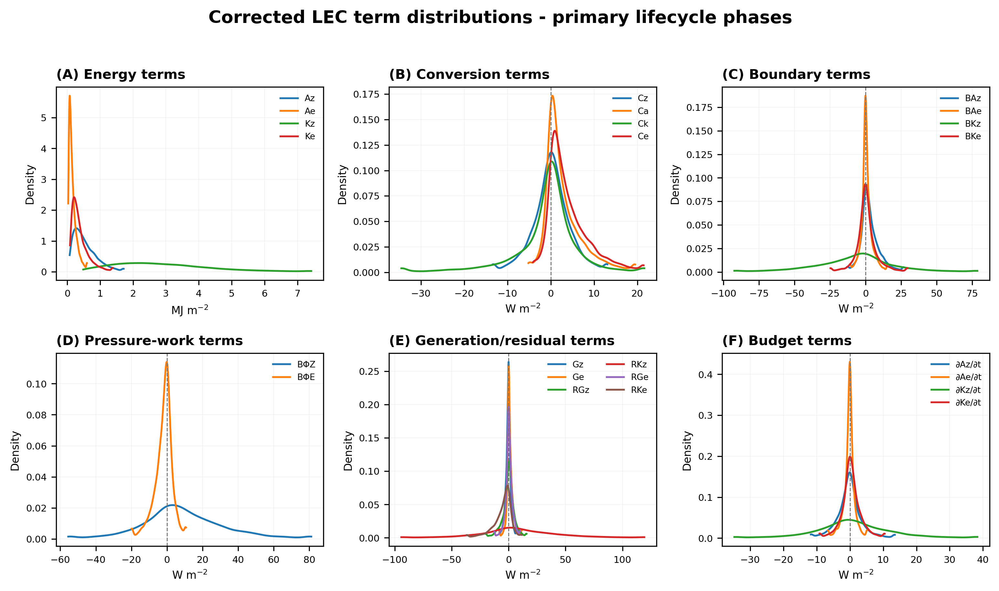

*Corrected probability-density functions of energy, conversion, boundary, pressure-work, generation/residual and budget terms.*

### Figure 4

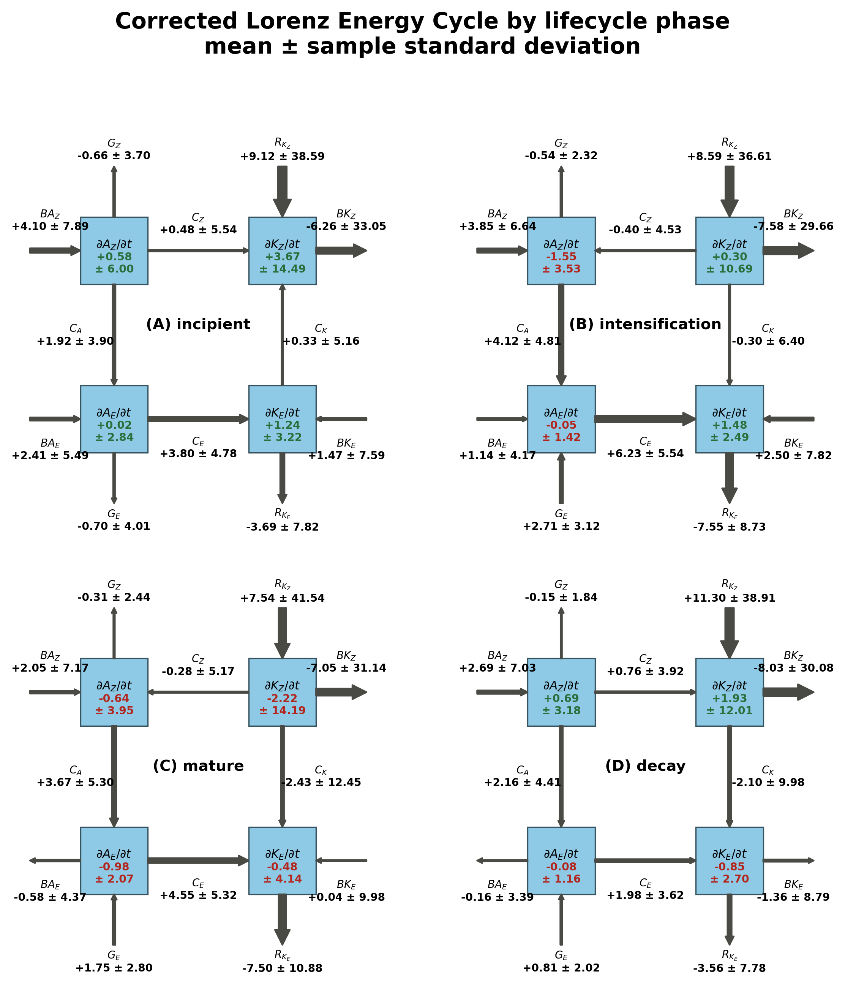

*Corrected mean Lorenz Energy Cycle by primary lifecycle phase; labels show mean plus or minus one sample standard deviation.*

### Figure 5

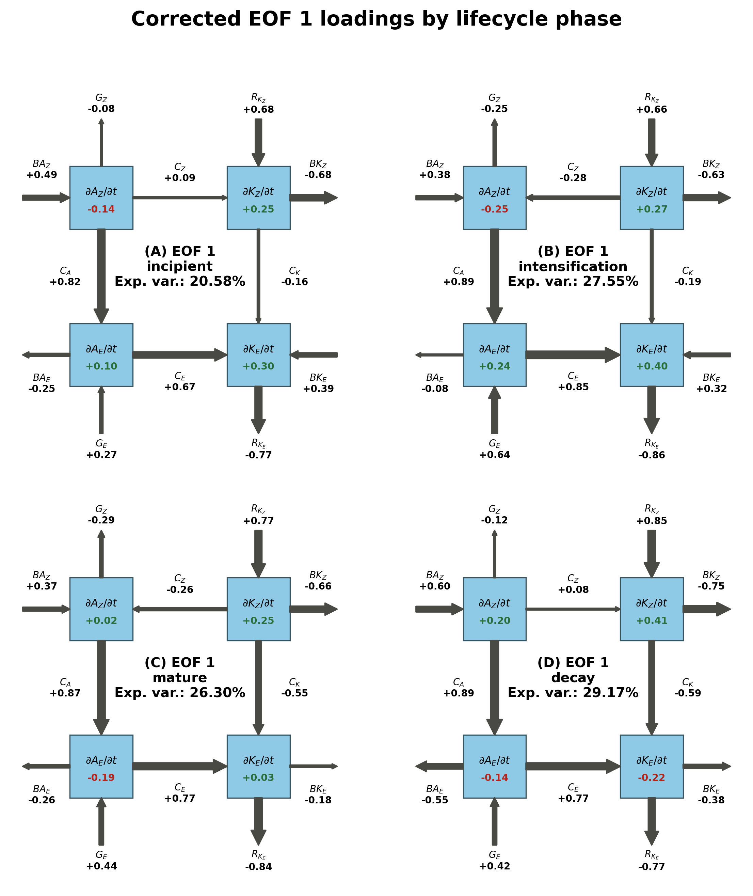

*Corrected EOF 1 loadings on the Lorenz Energy Cycle by lifecycle phase.*

### Figure 6

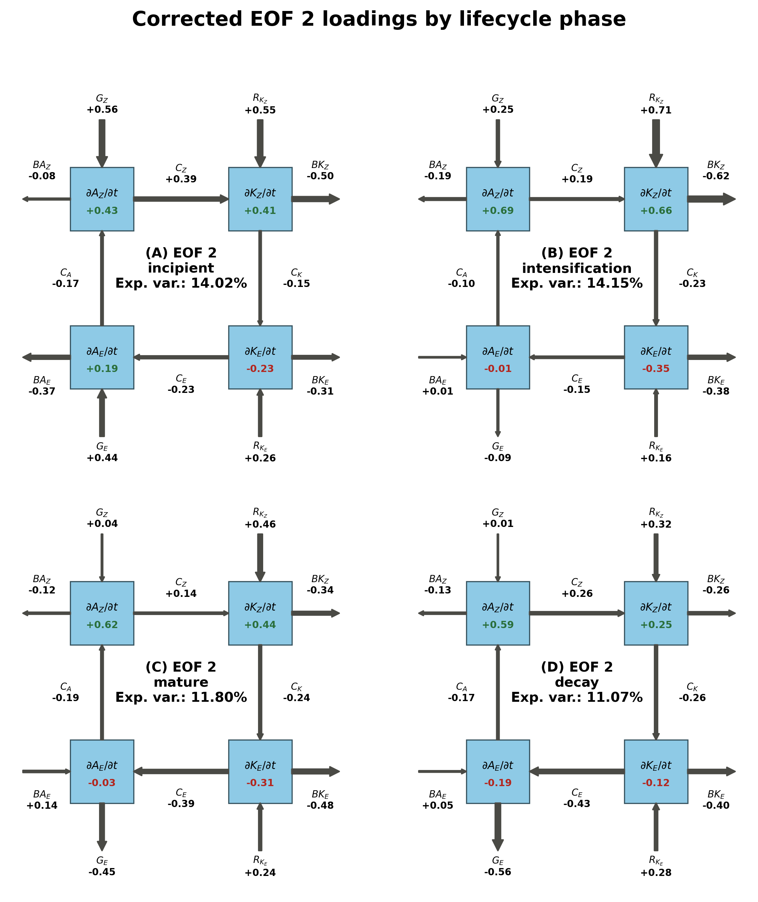

*Corrected EOF 2 loadings on the Lorenz Energy Cycle by lifecycle phase.*

### Figure 7

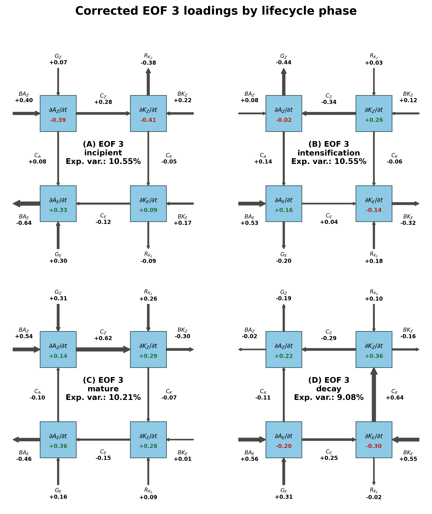

*Corrected EOF 3 loadings on the Lorenz Energy Cycle by lifecycle phase.*

### Figure 8

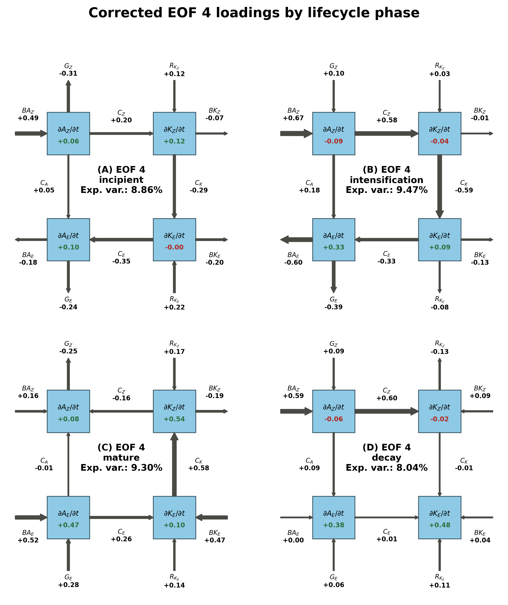

*Corrected EOF 4 loadings on the Lorenz Energy Cycle by lifecycle phase.*

### Figure 9

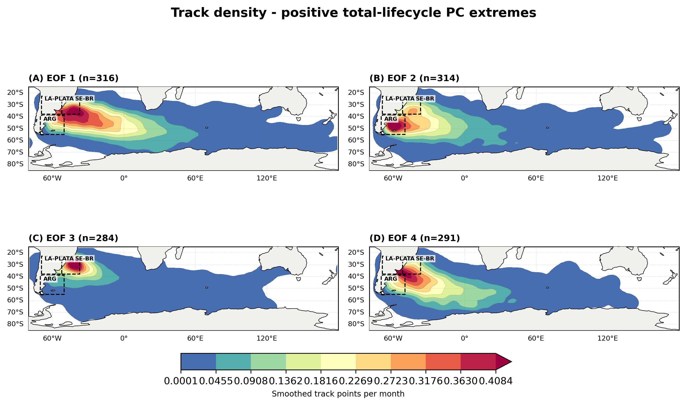

*Track densities for cyclones in the positive (upper-decile) extremes of total-lifecycle PCs 1-4.*

### Figure 10

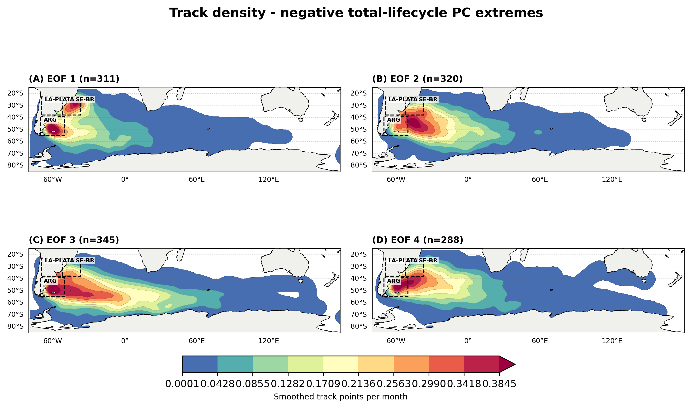

*Track densities for cyclones in the negative (lower-decile) extremes of total-lifecycle PCs 1-4.*

### Figure 11

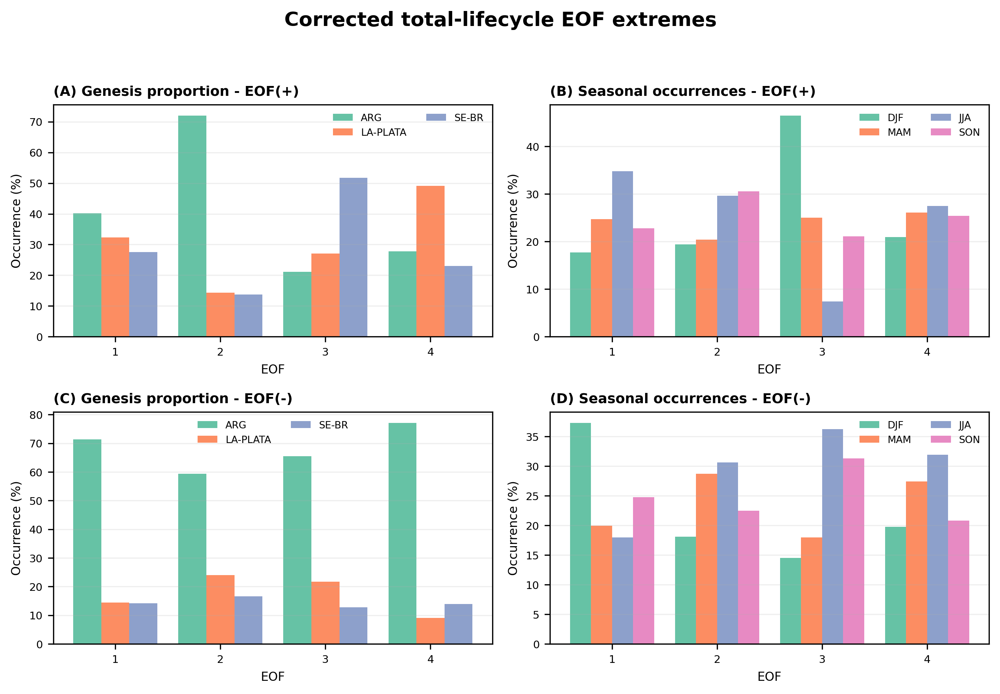

*Genesis-region and seasonal composition of the positive and negative PC extremes.*

### Figure 12

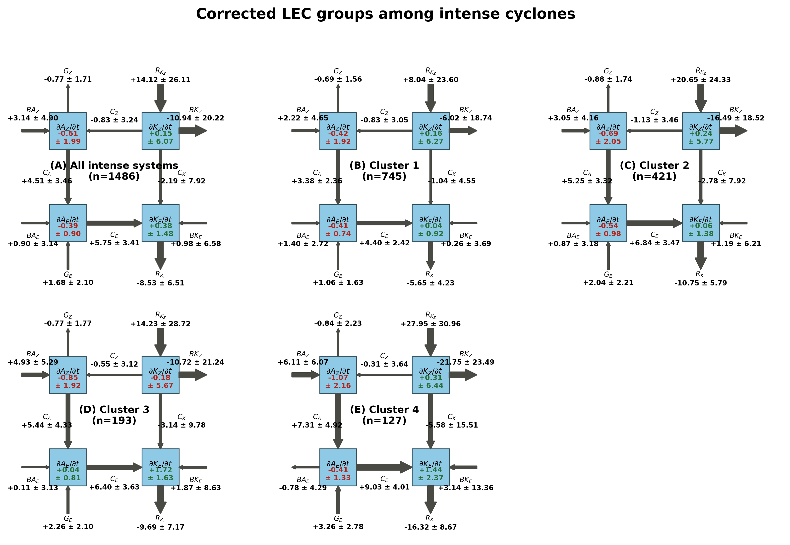

*Corrected mean Lorenz Energy Cycle for the intense-cyclone subset and its four deterministic K-means groups.*

### Figure 13

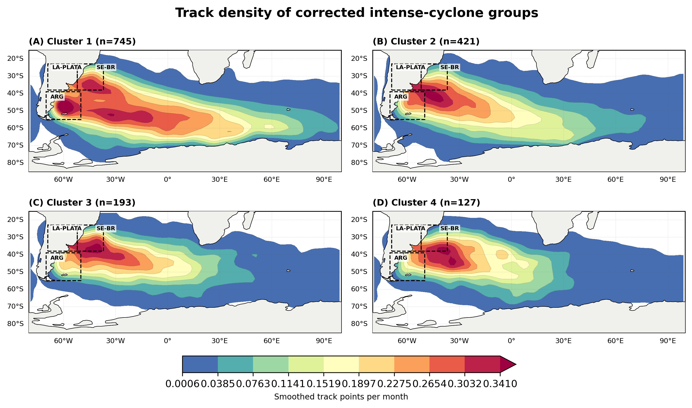

*Track densities of the four corrected intense-cyclone energy groups.*

### Figure 14

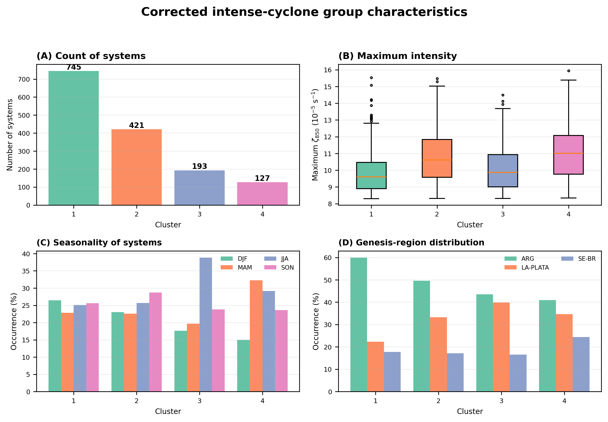

*Size, maximum intensity, seasonality and genesis-region composition of the corrected intense-cyclone groups.*

### Figure 15

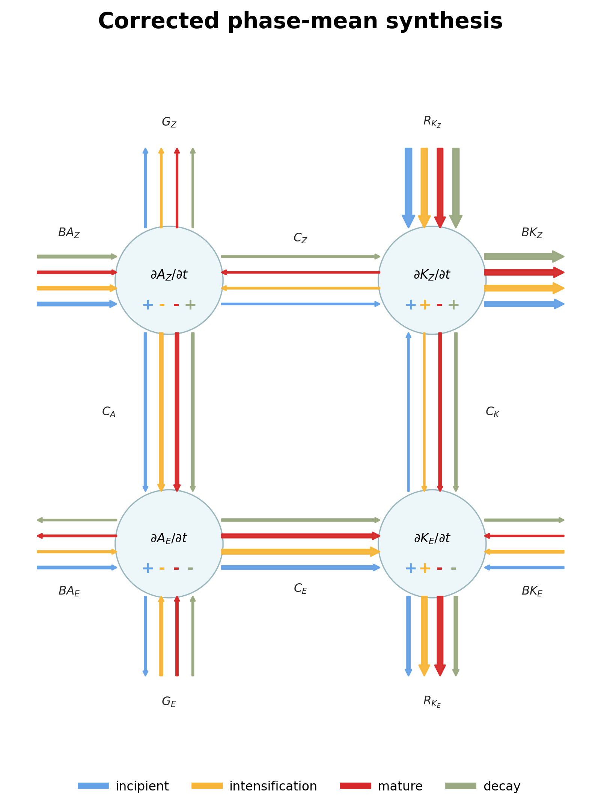

*Synthesis of the corrected mean Lorenz Energy Cycle across the four primary lifecycle phases.*

### Figure 16

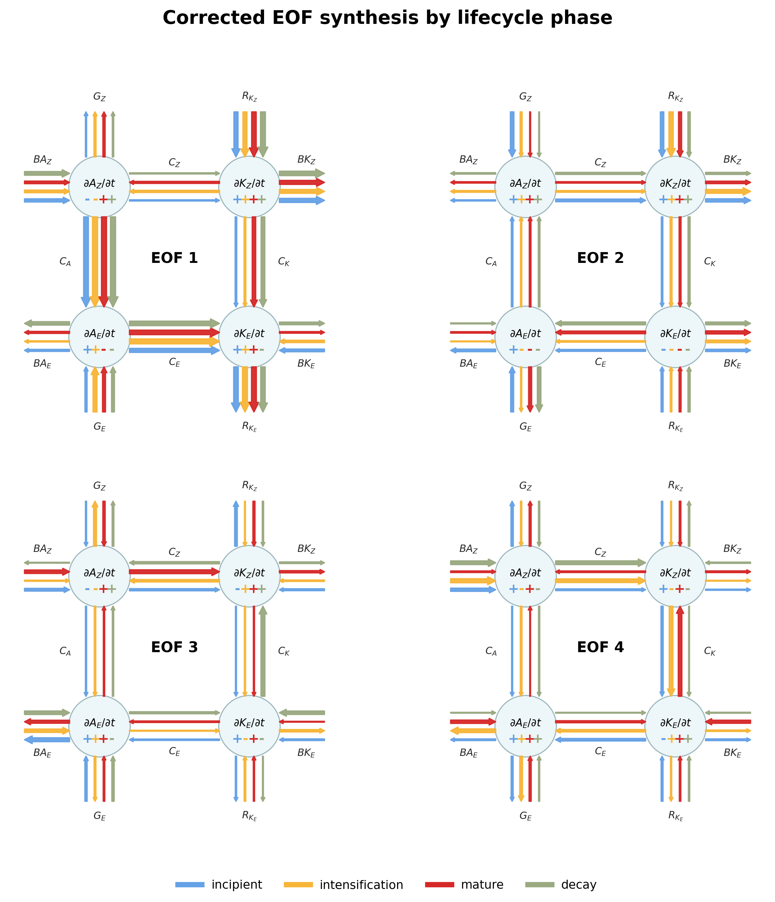

*Synthesis of corrected EOFs 1-4 across the four primary lifecycle phases.*

## Methodological notes

- EOFs are calculated from the correlation matrix of the 24 published LEC terms, separately by primary phase and for the cyclone-mean total lifecycle.
- EOF signs are oriented so that the largest-magnitude loading is positive; the sign itself has no physical meaning.
- Positive/negative EOF maps use upper/lower PC deciles and assign each selected cyclone to the most extreme of EOFs 1-4.
- Intense groups use the original six terms (Ck, Ca, Ke, Ge, BKe and BAe) across four phases without feature scaling. The implementation is deterministic (30 K-means++ restarts, seed 42).
- Density maps use a two-degree histogram followed by a Gaussian smoother; this replaces the legacy BallTree implementation while preserving the plotted scientific quantity and avoiding an unnecessary scikit-learn dependency.
