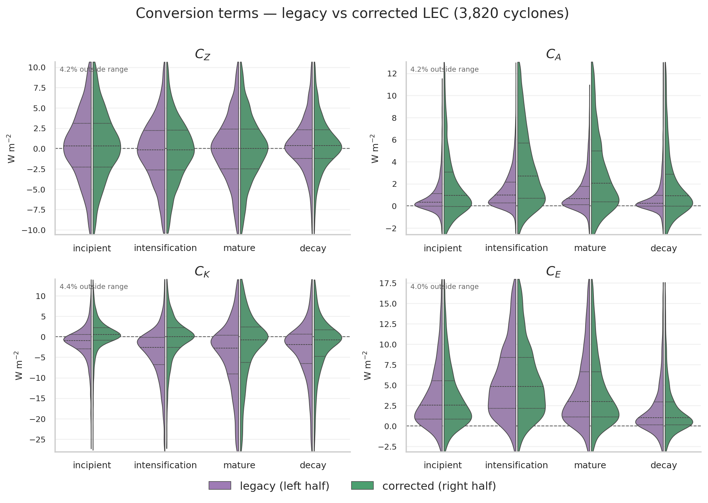
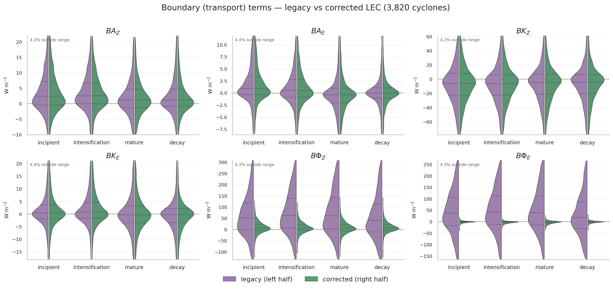
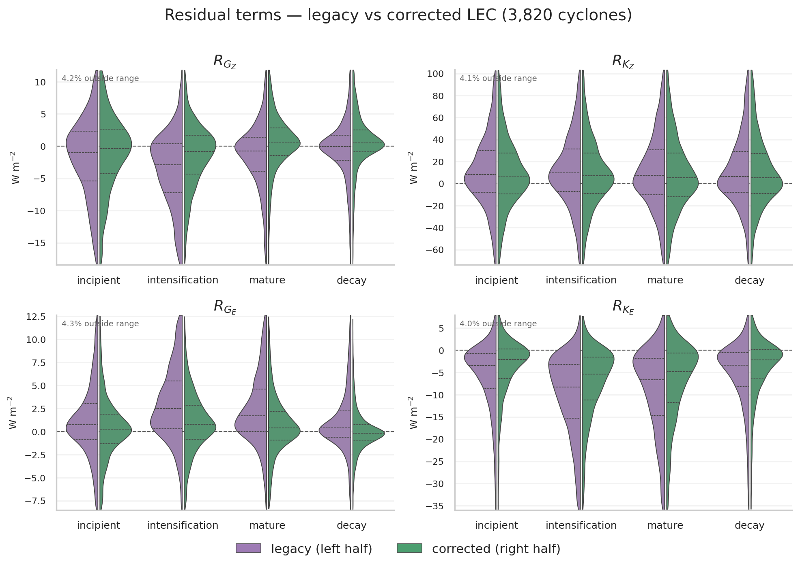
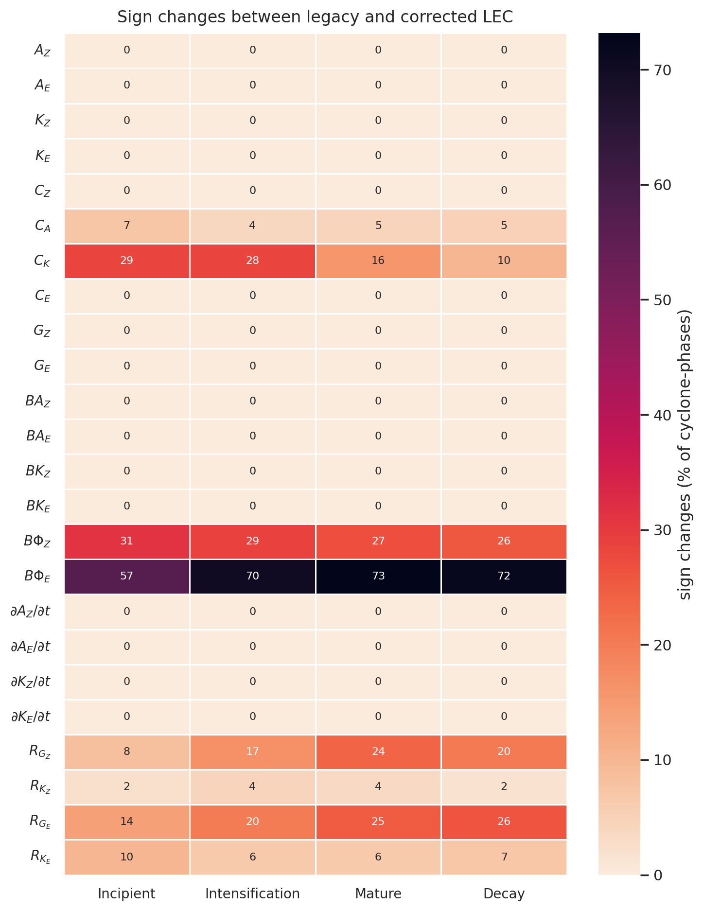
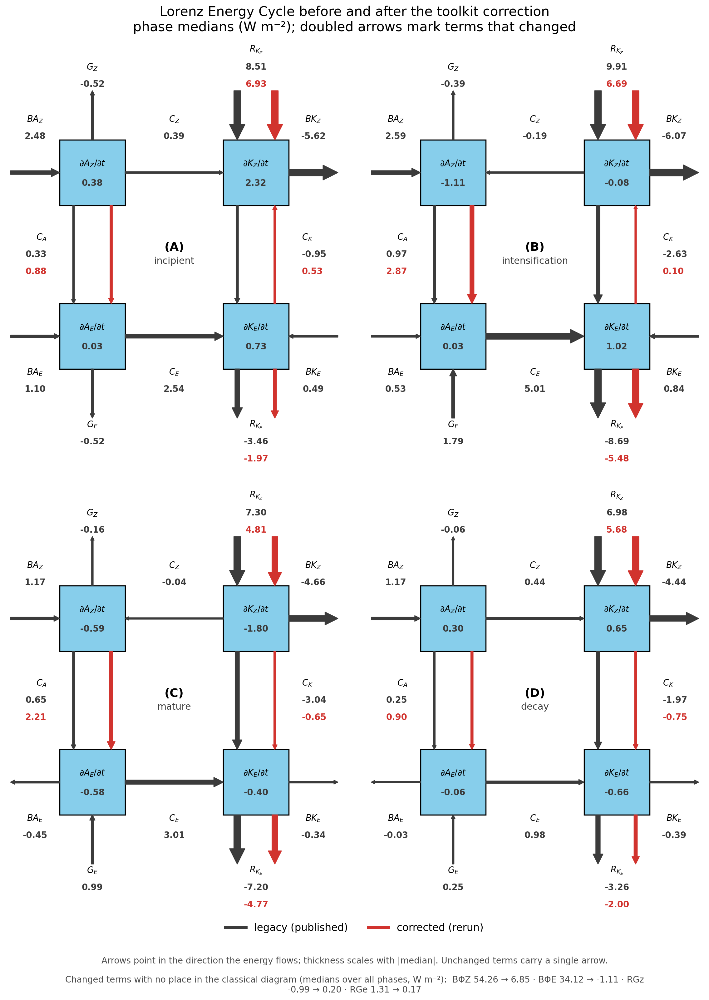
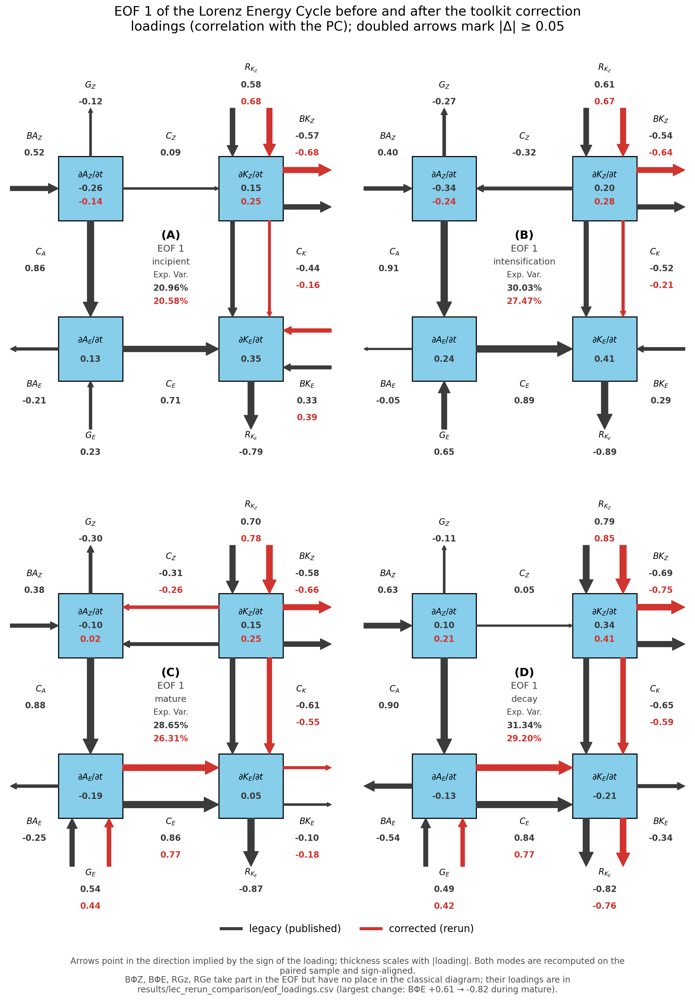

# Legacy vs corrected LEC climatology — technical report

**Author**: Danilo Couto de Souza · **Generated**: 2026-09-09 ·
**Reference article**: de Souza et al. (2025), *Clim. Dyn.*,
[10.1007/s00382-025-07918-y](https://doi.org/10.1007/s00382-025-07918-y)

The rerun is complete: all 3,820 cyclones are validated.

## 1. What is compared

The rerun (`scripts/lec_climatology_rerun`) recomputes the semi-Lagrangian Lorenz
Energy Cycle with LorenzCycleToolKit 2.0.0, which corrected `Ca`, the fifth `Ck`
subterm, `BΦZ`, `BΦE`, vertical-level alignment, time tendencies and NaN handling.
Everything else is held fixed: the same cyclones, the same frozen lifecycle
windows, the same 3-hourly time steps, the same 15° × 15° moving box and the same
32-level (10–1000 hPa) control volume. Both sides are phase means over identical
windows, so every difference reported here is attributable to the equation and
numerical correction alone.

The legacy side is `data/energy_cache.parquet`, the article input. Re-aggregating
the archived Zenodo per-cyclone results for 10 random
cyclones reproduces that cache to a maximum relative difference of
2e-14, confirming the two sides are built
the same way.

Paired sample: **3,820 cyclones**,
15,829 cyclone-phase rows,
24 terms.

## 2. What changed and what did not

16 of the 24 terms are numerically unchanged
(relative change below 1%, Spearman ≈ 1, essentially no sign
changes): Az, Ae, Kz, Ke, Cz, Ce, Gz, Ge, BAz, BAe, BKz, BKe, ∂Az/∂t, ∂Ae/∂t, ∂Kz/∂t and ∂Ke/∂t. This includes all four energy reservoirs, both
generation terms, the four lateral boundary transports and all four budget
tendencies — the corrections did not touch them.

The 8 terms that did change are exactly those the toolkit correction
targets, plus the residuals that inherit them (see
`figures/paired_control/violin_conversion.png` and `violin_boundary.png`;
the energy, generation and budget figures show the two halves of each violin
overlying each other exactly):

| Term | Group | Median legacy | Median corrected | Median Δ | Relative change | Spearman | Sign changes |
|---|---|---:|---:|---:|---:|---:|---:|
| Ca | conversion | 0.50 | 1.54 | 1.03 | 2.10× | 0.97 | 5.1% |
| BΦE | boundary | 34.12 | -1.11 | -36.38 | 1.03× | -0.42 | 68.1% |
| BΦZ | boundary | 54.26 | 6.85 | -43.86 | 0.87× | 0.48 | 28.2% |
| RGe | residual | 1.31 | 0.17 | -1.02 | 0.57× | 0.75 | 21.4% |
| Ck | conversion | -1.91 | -0.03 | 1.81 | 0.53× | 0.90 | 20.7% |
| RGz | residual | -0.99 | 0.20 | 1.03 | 0.42× | 0.85 | 17.5% |
| RKe | residual | -5.29 | -3.37 | 1.81 | 0.31× | 0.98 | 7.5% |
| RKz | residual | 8.18 | 6.04 | -1.81 | 0.09× | 1.00 | 3.0% |

*Figure 1. Conversion terms, legacy (left half) versus corrected (right half) of each violin, by life-cycle phase. C_A shifts upward in every phase and C_K crosses zero.*

*Figure 2. Boundary transport terms. The four lateral fluxes are unchanged; the two pressure-work terms BΦZ and BΦE collapse.*

*Figure 3. Residual terms, which inherit the C_A and C_K corrections through the budget closure.*

The energy, generation and budget-tendency violins are not reproduced here: the
two halves of every violin coincide exactly. They are in
`figures/paired_control/` if a reader wants to confirm it.

*Relative change* is the median |Δ| divided by the median |legacy| value: 1.00×
means the typical change is as large as the term itself. *Spearman* is the
rank correlation between the two versions across cyclone-phases — the quantity
that matters for the downstream PCA and k-means, which depend on ordering.

Three features stand out:

- **`Ca` roughly triples** (median 0.50 →
  1.54 W m⁻²) but keeps its ranking
  (Spearman 0.97) and its sign in
  95% of cases. Baroclinic conversion
  is systematically stronger, not reordered.
- **`Ck` shifts by about 1.81 W m⁻²**, an almost
  uniform positive offset that carries the median from
  -1.91 to
  -0.03 W m⁻². The shift is largest in the
  intensification phase (2.96 W m⁻²).
- **The pressure-work boundary terms collapse.** `BΦZ` and `BΦE` lose most of
  their amplitude, and `BΦE` is now *anti*-correlated with its legacy counterpart
  (Spearman -0.42), so the legacy term cannot be
  rescaled into agreement — its structure was wrong, not just its amplitude.

The residuals `RGz`, `RKz`, `RGe` and `RKe` change by the same amounts as `Ca` and
`Ck` with opposite signs, as expected from the budget closure — they are a
consistency check rather than an independent finding. The corrected toolkit also
outputs two terms with no legacy counterpart (`C_overturning`, `M`); they are not
comparable and are excluded.

## 3. Sign changes

Sign is what carries physical meaning in the LEC, so a change of sign matters more
than a change of magnitude. Per-sample sign-change rates are in
`figures/paired_control/signflip_heatmap.png`; the terms at risk are
Ca, Ck, BΦZ, BΦE, RGz, RGe and RKe.
The worst case is BΦE, which changes sign in
68% of cyclone-phases.

*Figure 4. Percentage of cyclone-phases whose term changed sign between the two versions.*

The terms that change the sign of their *pooled climatological median* are
**BΦE and RGz**. Although the pooled `Ck` median remains slightly negative,
its phase median changes sign during incipience and intensification. `Ck` is the
consequential clustering term because it enters the conversion LPS; `BΦE` and
`RGz` enter neither, appearing only in the all-terms effect-size figure (Fig. S2),
which would need regenerating but carries no headline claim.

## 4. Consequences for the interpretation

**The clustering input is only partly affected.** The energy patterns are built from
seven terms (Ca, Ck, BAe, BKe, Ae, Ke and Ge) across four phases. 5
of the seven (BAe, BKe, Ae, Ke and Ge) are
unchanged; only Ca and Ck move. The EP separation should therefore
survive in outline, but the two conversion terms are precisely the ones that define
the conversion Lorenz Phase Space and the EP1 signature, so the clustering must be
rerun before any EP statement is reasserted.

**The barotropic result is the one that moves.**
`figures/paired_control/lec_diagram_before_after.png` shows this on the
four-box diagram: the `Ck` arrow reverses between the two versions during the
incipient and intensification phases, and shortens during maturity and decay.
With the convention of de Souza et al. (2025) — `Ca` > 0 feeds eddy APE,
`Ck` < 0 feeds eddy KE:

| Phase | Ck < 0 (legacy → corrected) | Ca > 0 & Ck < 0 | \|Ck\| > \|Ca\| with Ck < 0 | Median Ck |
|---|---|---|---|---|
| incipient | 67% → 39% | 53% → 30% | 57% → 19% | -0.95 → 0.53 |
| intensification | 77% → 48% | 69% → 43% | 70% → 19% | -2.63 → 0.10 |
| mature | 71% → 55% | 62% → 50% | 66% → 37% | -3.04 → -0.65 |
| decay | 69% → 58% | 58% → 51% | 65% → 42% | -1.97 → -0.75 |
| all phases | 71% → 50% | 61% → 43% | 65% → 29% | -1.91 → -0.03 |

Pooled over the life cycle, the share of cyclone-phases with barotropic conversion
feeding the eddy falls from 71% to
50%, occupancy of the doubly eddy-feeding
quadrant falls from 61% to
43%, and the share of cases where
barotropic conversion exceeds baroclinic conversion falls from
65% to
29%. During intensification the
last figure drops from 70% to
19%.

*Figure 5. Four-box Lorenz Energy Cycle by life-cycle phase: (A) incipient, (B) intensification, (C) mature, (D) decay. Dark is legacy, red is corrected.*

This weakens the article's headline claim that barotropic conversions are ubiquitous
during cyclone evolution and can exceed baroclinic conversions. In the corrected
climatology, barotropic conversion is close to neutral in the median, it is a
minority contributor during intensification, and it feeds the eddy in roughly half
of the cases rather than seven in ten. Two qualitative statements survive and one
does not:

- *Survives*: baroclinic conversion feeds the eddy in the large majority of cases,
  and is now unambiguously the dominant eddy source (`Ca` roughly tripled while
  `Ck` moved toward zero).
- *Survives, restated*: barotropic conversion remains present and eddy-feeding in a
  substantial minority of cyclone-phases, so it is still a real pathway — it is no
  longer the typical one.
- *Does not survive as stated*: the ordering of the phases. The legacy `Ck` was most
  strongly eddy-feeding during intensification and maturity; the corrected `Ck` is
  weakest during the incipient phase and becomes progressively more eddy-feeding
  toward decay. Any statement tying the barotropic peak to maturity needs to be
  rechecked against the corrected LPS.

**The leading EOF survives in shape but is reweighted.**
`figures/paired_control/eof1_diagram_before_after.png` redraws the thesis
EOF figure with both versions on the same axes. EOF 1 still explains a comparable
share of the variance (21-31% before, 21-29% after) and the two
patterns correlate at 0.77-0.86 across phases, so the mode is recognisably the
same. 7 of the 24 loadings move by less than 0.05, including
BAz, ∂Ae/∂t, Gz, Az and Ca. The largest shifts are BΦE (1.43), RGe (0.67), RGz (0.61), i.e. the terms the
correction hit directly; among the terms the classical diagram actually shows, the
largest are Ck (0.31), ∂Az/∂t (0.12), BKz (0.11). The pattern is therefore stable where the
underlying terms did not change and moves where they did — which is what the
downstream PCA and k-means will inherit, and another reason to rerun them rather
than assume the EPs carry over. Beyond the leading mode the rank itself is not preserved — legacy EOF 2 in the incipient phase matches corrected mode 3; legacy EOF 3 in the incipient phase matches corrected mode 2; legacy EOF 2 in the intensification phase matches corrected mode 4; legacy EOF 3 in the intensification phase matches corrected mode 2; legacy EOF 4 in the intensification phase matches corrected mode 3; legacy EOF 2 in the mature phase matches corrected mode 3; legacy EOF 3 in the mature phase matches corrected mode 2; legacy EOF 3 in the decay phase matches corrected mode 4; legacy EOF 4 in the decay phase matches corrected mode 3 — because EOF 2 and EOF 3 explain similar variance and the correction is enough to reorder them. The figures pair modes by pattern correlation rather than by rank; comparing them by rank would be misleading.

*Figure 6. EOF 1 loadings on the LEC diagram, by phase: (A) incipient, (B) intensification, (C) mature, (D) decay. Dark is legacy, red is corrected.*

The same diagram for EOF 2 to EOF 4 (Figures 6 to 8 of the article) is in
`eof2_diagram_before_after.png`, `eof3_...` and `eof4_...`.

The `BΦ` collapse does not affect the published figures (the article uses `BAe` and
`BKe` for the import LPS, both unchanged), but it does affect the budget closure and
any future use of the pressure-work terms.

## 5. Caveats

- The population is complete.
- Statistics are medians and rank correlations throughout, because LEC phase means
  are heavy tailed. The violin figures are trimmed for display only; every number
  here uses the full sample.
- Secondary lifecycle periods (`decay 2`, etc.) are matched to their own legacy
  counterpart and folded into the parent phase, as in the corrected cache builder.
  Rows named `residual` are excluded.
- This report compares diagnostics, not conclusions. Nothing here substitutes for
  rerunning the PCA, the k-means and the EP figures on the corrected cache.

## 6. Files

| Artifact | Path |
|---|---|
| This report (PDF, figures embedded) | `docs/paired_control/lec_rerun_paired_control_report.pdf` |
| Paired table | `results/paired_control/paired_terms.parquet` |
| Term summary | `results/paired_control/term_change_summary.csv` |
| Per-phase summary | `results/paired_control/term_change_by_phase.csv` |
| Conversion regime | `results/paired_control/conversion_regime.csv` |
| Coverage / provenance | `results/paired_control/coverage.json` |
| Split-violin figures | `figures/paired_control/violin_{energy,conversion,generation,boundary,budget,residual}.png` |
| Sign-change heatmap | `figures/paired_control/signflip_heatmap.png` |
| Before/after LEC diagram | `figures/paired_control/lec_diagram_before_after.png` |
| Before/after EOF diagrams | `figures/paired_control/eof{1,2,3,4}_diagram_before_after.png` |
| EOF loadings and variance | `results/paired_control/eof_loadings.csv`, `eof_variance.csv` |
